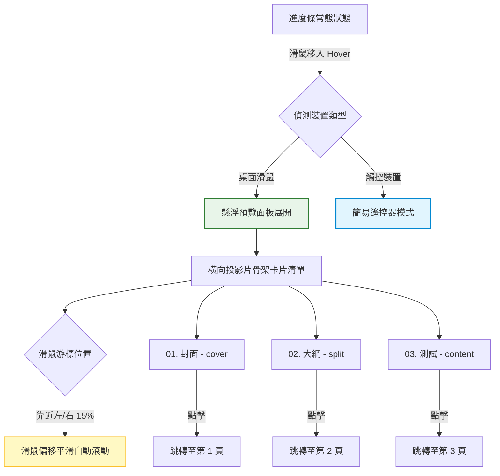

# 投影片懸浮預覽導覽（方案三：標題骨架卡片）實作計劃

本計劃評估並規劃如何將現有的簡報下方進度條（ProgressBar）升級為**「滑鼠懸浮時，展開每一頁投影片的精緻骨架卡片」**，供使用者直接點選跳轉。本案採用**方案三（標題骨架屏卡片）**，在確保極佳載入效能的同時，提供 premium 的毛玻璃微互動體驗。

---

## 1. 設計目標與美學規範 (Aesthetics & UX)
*   **觸發機制**：預設維持下方進度條與頁碼顯示。當滑鼠指針移入（Hover）進度條區域時，上方流暢展開（Slide Up + Fade In）一個半透明的橫向卡片列。
*   **視覺風格 (Glassmorphism)**：
    *   面板背景採用深色半透明毛玻璃質感（如 `rgba(30, 45, 38, 0.7)`，搭配 `backdrop-filter: blur(12px)`），與主視覺「大樹母片」的綠色色調契合。
    *   卡片邊框使用細微的漸層亮邊，提升高級感。
*   **骨架屏卡片設計**：
    每張卡片代表一頁投影片，定義最小寬度（如 `180px`）。內容包含：
    1.  **大字號漸層頁碼**：例如 `01`、`02`，使用強烈的字型對比。
    2.  **小標題與章節簡介**：**由 Agent 根據投影片內容在代碼端統一定義對照表**，並在卡片中顯示（例如：`封面`、`簡報大綱`、`動畫與壓力測試` 等），無需改動 slide 組件本身。
    3.  **多樣化骨架結構 (Layout Skeleton)**：依據投影片類型渲染不同的骨架示意圖，提升視覺辨識度：
        *   `cover` 類型：渲染置中大粗條，模擬封面標題。
        *   `outline`/`split` 類型：渲染左右雙欄的小色塊，模擬兩欄式排版。
        *   `content` 類型：渲染多行等寬細線，模擬圖文並排。
*   **微動畫與互動 (Micro-animations & Horizontal Auto-Scroll)**：
    *   卡片 Hover 時向上微浮（`transform: translateY(-6px)`）並加亮邊框。
    *   當前頁（Active Slide）的卡片周圍帶有呼吸燈式的綠色發光邊框（使用 theme1 的 Accent 色 `#99CB38`）。
    *   **無摩擦滾動機制 (Hover Scroll)**：為防止多頁面時手動拖曳滾動條的繁瑣，滑鼠移動到懸浮面板左右側特定邊界（例如左右各 15% 寬度區域）時，面板將自動平滑地朝該方向橫向滾動（滾動速度隨滑鼠偏移量動態調整）。

---

## 2. 移動端與觸控裝置特化 (Mobile & Touch Devices UX)
針對行動端、平板或簡報筆觸控螢幕等無滑鼠 Hover 狀態的裝置，本系統將進行特化設計：
*   **純遙控器模式 (Remote Controller Mode)**：偵測到觸控裝置（如 `pointer: coarse` 或觸控事件）時，隱藏複雜的懸浮卡片列。
*   **介面簡化**：底部導覽列轉化為簡潔的「遙控器介面」，主要包含：
    1.  **超大「上一頁」與「下一頁」觸控按鈕**，防誤觸且便於單手操控。
    2.  **簡易下拉選單／頁碼指示**：點選可快速選擇跳轉至特定章節或頁面。

---

## 3. 影響範圍與元件關係
本案不涉及任何簡報核心邏輯重構。我們僅需要修改一個 UI 組件與其對應的樣式：
*   [ProgressBar.tsx](file:///c:/Users/bt-user/Desktop/簡報網頁/src/components/chrome/ProgressBar.tsx)：引入控制 Context 與投影片清單，負責：
    1. 實作滑鼠在面板左右兩側的偏移偵測以觸發 `scrollLeft` 平滑滾動。
    2. 動態渲染不同 layout 類型的骨架卡片。
    3. 整合觸控裝置偵測，並渲染簡化遙控器。
*   `ProgressBar.css`（或專案內控制進度條的 CSS 檔案）：新增懸浮面板、卡片骨架、滾動區域以及觸控遙控器的 CSS 樣式與動畫。

---

## 4. 實作步驟說明

### 步驟一：定義小標題與 Layout 對照表
在 [ProgressBar.tsx](file:///c:/Users/bt-user/Desktop/簡報網頁/src/components/chrome/ProgressBar.tsx) 內定義投影片的後設資料，避免污染原始組件：
```typescript
interface SlideMetadata {
  title: string;
  layout: 'cover' | 'split' | 'content';
}

const SLIDE_METADATA_MAP: Record<string, SlideMetadata> = {
  'cover': { title: '簡報封面', layout: 'cover' },
  'outline': { title: '簡報大綱', layout: 'split' },
  'stress-test': { title: '動畫壓力測試', layout: 'content' },
};
```

### 步驟二：實作滑鼠偏移自動橫移 (Hover-to-Scroll)
使用 React Ref 綁定懸浮面板，並在面板的 `onMouseMove` 事件中計算滑鼠相對於面板寬度的百分比：
*   若滑鼠靠近左側 ($X < 15\%$)：使用 `requestAnimationFrame` 讓 `scrollLeft` 平滑減少。
*   若滑鼠靠近右側 ($X > 85\%$)：使用 `requestAnimationFrame` 讓 `scrollLeft` 平滑增加。
*   偏移量越靠近邊緣，滾動速度越快；滑鼠移入中間區域則滾動停止。

### 步驟三：設計多樣化骨架屏（React 部分）
```tsx
const renderSkeleton = (layout: 'cover' | 'split' | 'content') => {
  switch (layout) {
    case 'cover':
      return (
        <div className="skeleton-cover">
          <div className="skeleton-line title-center" />
          <div className="skeleton-line sub-center" />
        </div>
      );
    case 'split':
      return (
        <div className="skeleton-split">
          <div className="skeleton-col" />
          <div className="skeleton-col" />
        </div>
      );
    case 'content':
    default:
      return (
        <div className="skeleton-content">
          <div className="skeleton-line short" />
          <div className="skeleton-line long" />
          <div className="skeleton-line medium" />
        </div>
      );
  }
};
```

### 步驟四：整合移動端遙控器模式
使用 React Hook 偵測觸控支援（如 `window.matchMedia('(pointer: coarse)').matches`），若為真，則渲染下方簡易按鈕群：
```tsx
if (isTouchDevice) {
  return (
    <div className="mobile-remote-bar">
      <button onClick={() => gotoIndex(currentIndex - 1)}>◀ PREV</button>
      <span className="page-indicator">{currentIndex + 1} / {totalSlides}</span>
      <button onClick={() => gotoIndex(currentIndex + 1)}>NEXT ▶</button>
    </div>
  );
}
```

---

## 5. 預期效果圖結構 (Mermaid)



---

## 6. 驗證與測試計畫
*   **滑鼠偏移滾動測試**：確認滑鼠移到懸浮面板兩側邊緣時，面板能平滑無晃動地滾動，並在移回中央時立即停下。
*   **骨架辨識度測試**：確認不同 layout 類型的投影片卡片，會對應顯示不同的 CSS 骨架線條。
*   **觸控遙控器測試**：使用瀏覽器的行動端模擬器（觸控模式），確認縮圖面板被隱藏，取而代之的是易於點選的大顆按鈕遙控介面。
